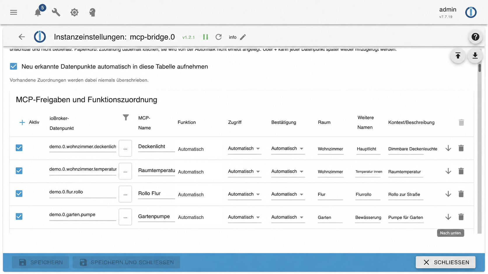

sed: --: No such file or directory
# ioBroker MCP Gateway


Self-hosted bridge between ioBroker and MCP clients such as ChatGPT. No inbound port is required in the home network: the ioBroker adapter initiates an outbound MQTT/TLS connection to a small Docker stack on a public VPS.

## Adapter backend



## What it contains

```text
ioBroker adapter
  -> MQTT over TLS
  -> Gateway application
  -> versioned integration API
  -> MCP translation service
  -> MCP client
```

- Automatic discovery of ioBroker states with `common.smartName`
- Editable adapter-side mapping table for every published state
- Optional include/exclude patterns
- Retained device catalog and live states
- German natural-language commands such as “alle Lichter aus”
- Safety confirmation for locks, doors, gates, alarms and similar states
- Web UI for devices, values and editable context (room, category, aliases, description)
- Admin-managed users, Argon2id passwords, persistent sessions and audit log
- Revocable API tokens with scopes
- OAuth Authorization Code flow with PKCE S256
- Stateless Streamable HTTP MCP endpoint
- Explicit input and output schemas for every MCP tool

## Security architecture

The MCP container never connects to MQTT, PostgreSQL or ioBroker. It calls only the versioned gateway API below `/api/integrations/v1/`. Authentication, roles, scopes, device rules and audit logging are enforced by the gateway application.

The gateway and MCP HTTP ports bind to `127.0.0.1`. Nginx terminates HTTPS. Only the MQTT/TLS port is exposed for the outbound home connection. Application API tokens are created in the web UI, stored as hashes and never placed in `.env`.

## Docker deployment model

All application components run in Docker. No Node.js runtime, npm package, PostgreSQL server, Mosquitto service or application process is installed directly on the VPS host.

| Compose service | Container | Purpose | Host exposure |
| --- | --- | --- | --- |
| `app` | `iobroker_gateway_app` | Web UI, users, OAuth, integration API and device logic | `127.0.0.1:8139` only |
| `mcp` | `iobroker_gateway_mcp` | MCP protocol translation to the integration API | `127.0.0.1:8140` only |
| `postgres` | `iobroker_gateway_postgres` | Persistent users, sessions, tokens, context and audit | no host port |
| `broker` | `iobroker_gateway_broker` | Isolated MQTT bridge | TLS port `8884` |

Only these host-level components are used:

- Nginx for the public HTTPS reverse proxy
- Certbot for certificates
- Docker Engine and Docker Compose
- files below `/opt/iobroker-mcp`

The installation script ultimately starts the application with:

```sh
cd /opt/iobroker-mcp/deploy
docker compose up -d --build
docker compose ps
```

## Requirements

- Public Linux VPS with Docker Compose, Nginx and Certbot
- DNS hostname pointing to the VPS
- ioBroker with Node.js 20 or newer
- SSH access to VPS and ioBroker host

## VPS installation

Clone or copy the project to `/opt/iobroker-mcp`, then issue a certificate before starting the stack:

```sh
sudo mkdir -p /opt/iobroker-mcp
cd /opt/iobroker-mcp
# copy this repository here

sudo certbot certonly --webroot -w /var/www/html -d mcp.example.com
sudo DOMAIN=mcp.example.com ADMIN_EMAIL=admin@example.com ./deploy/install-vps.sh
```

The script:

1. generates independent random PostgreSQL, MQTT and bootstrap credentials;
2. creates Mosquitto users and ACLs;
3. copies the TLS certificate into the isolated broker;
4. builds and starts four containers;
5. installs the Nginx site and a certificate-renewal hook.

The initial administrator password is written once to:

```text
/opt/iobroker-mcp/INITIAL_ADMIN_PASSWORD
```

Change it in the user administration after the first login.

## ioBroker adapter installation

Copy `adapter/` to the ioBroker host and install it as a custom adapter according to your ioBroker version. Configure the instance:

```sh
iobroker set mcp-bridge.0 \
  --mqttUrl mqtts://mcp.example.com:8884 \
  --mqttUsername iobroker_mcp_bridge \
  --secretFile /opt/iobroker/iobroker-data/mcp-bridge-secret \
  --caFile /opt/iobroker/iobroker-data/mcp-broker-ca.crt
iobroker start mcp-bridge.0
```

Copy `deploy/secrets/bridge_password` securely to the configured `secretFile`. Use the issuing root CA certificate for `caFile`. Do not copy private TLS keys to the ioBroker host.

By default the adapter publishes states that have `common.smartName` and excludes `alexa2.*`, `iot.*`, `mqtt.*` and `system.*`. Newly added or changed ioBroker objects trigger an automatic catalog rebuild.

### Device and endpoint mappings

Open the `mcp-bridge` instance settings in ioBroker Admin. Under **Veröffentlichte Geräte und Datenpunkte**, the adapter maintains one row for every published endpoint. Newly discovered states are appended automatically; existing edits are preserved.

Each row controls whether the state is published, its MCP name and aliases, semantic function, read/write access, safety confirmation, room and descriptive context. Use the add button to select any other ioBroker state, even without `common.smartName`. Saving restarts the adapter and republishes the resulting catalog. Disabling a row preserves its configuration but removes it from MQTT and MCP. Deleting a row also removes it from MQTT and MCP and records the object ID internally so automatic discovery does not recreate it; it can still be added again explicitly.

The fields **MCP name**, **room**, **additional names** and **context/description** are included in the catalog sent to the gateway and MCP server. They help an MCP client interpret natural-language requests. For example:

| Field | Example |
| --- | --- |
| MCP name | `Deckenlicht` |
| Room | `Wohnzimmer` |
| Additional names | `Hauptlicht, Esstischlampe` |
| Context/description | `Dimmbare Deckenleuchte über dem Esstisch; nicht mit der Stehlampe verwechseln.` |

## MCP connection

Use this endpoint in an OAuth-capable MCP client:

```text
https://mcp.example.com/mcp
```

Discovery endpoints:

- `/.well-known/oauth-protected-resource`
- `/.well-known/oauth-authorization-server`

Scopes:

- `read:devices`
- `write:devices`
- `read:audit`

### Connect the MCP server to ChatGPT

The exact ChatGPT menus and plan availability may change while custom MCP apps are in beta. OpenAI currently documents custom MCP apps in ChatGPT's **developer mode**.

1. Open ChatGPT on the web and go to **Settings → Apps → Advanced settings**. Enable **Developer mode**. In managed workspaces an administrator may first need to allow this under **Workspace settings → Permissions & roles → Connected data**.
2. Open **Settings → Apps → Create** (or **Workspace settings → Apps → Create**, depending on the workspace).
3. Enter a name such as `ioBroker MCP`.
4. Enter the public MCP endpoint:

   ```text
   https://<your-domain>/mcp
   ```

   For the example deployment in this project this is `https://iobroker.mcp.schreiber.info/mcp`.
5. Select OAuth authentication when ChatGPT asks for authentication. The server exposes the required OAuth discovery metadata automatically.
6. Choose **Scan tools**, complete the gateway login and approve the requested scopes. For device control, the connection needs `write:devices`; read-only use needs `read:devices`.
7. Select **Create**. The app appears with a `Dev` label while it is a development app.
8. Start a new chat, select `ioBroker MCP` from the tools/apps menu and try prompts such as:

   ```text
   Welche Geräte sind im Wohnzimmer verfügbar?
   Ist das Deckenlicht eingeschaltet?
   Schalte das Deckenlicht im Wohnzimmer aus.
   ```

Write actions can trigger an additional ChatGPT confirmation. If MCP tools change later, refresh or recreate the development app so ChatGPT scans the current tool definitions. See OpenAI's current [developer mode and MCP apps documentation](https://help.openai.com/en/articles/12584461-developer-mode-and-full-mcp-connectors-in-chatgpt).

## MCP tools

- `gateway_health`
- `gateway_me`
- `list_devices`
- `get_device_state`
- `set_device_state`
- `execute_home_command`
- `list_audit_logs`

## Validation

```sh
cd /opt/iobroker-mcp/deploy
docker compose ps
curl -s http://127.0.0.1:8139/api/integrations/v1/health
curl -s http://127.0.0.1:8140/health
```

`deploy/acceptance-test.py` performs dynamic OAuth registration, PKCE authorization, token exchange, verifies all MCP output schemas, calls a real MCP tool and revokes the token. Supply credentials only as process environment variables when running it.

## License

MIT
